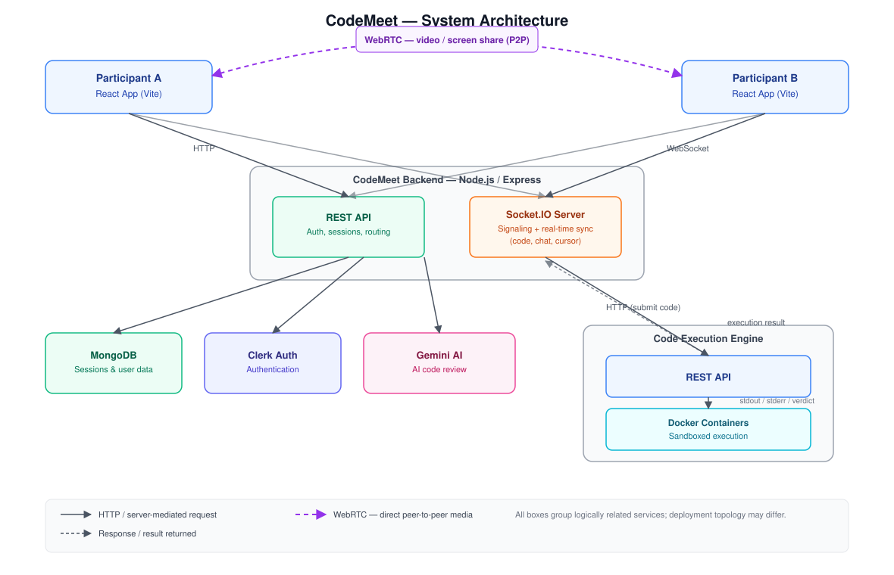

# CodeMeet

A real-time collaborative coding platform that enables developers to solve programming problems together, communicate through video calls, screen sharing, and a shared workspace, execute code, submit solutions, and receive AI-powered feedback.


---

## Overview

CodeMeet is a full-stack collaborative coding platform designed for pair programming, coding practice, technical interviews, and collaborative problem-solving.

Two participants can join the same coding session and work together in real time — editing code simultaneously, communicating through an integrated chat and live video call, sharing their screen, executing and submitting solutions, and receiving AI-generated feedback on their work.

---

## Features

### Real-Time Collaborative Coding

- Create a coding session with a selected problem
- Share a unique room ID with another participant
- Support for two users collaborating within the same session
- Real-time code synchronization via Socket.IO
- Real-time programming language synchronization
- Session-based collaborative workspace

### Real-Time Chat

- Built-in session chat
- Real-time message delivery between participants
- Message synchronization via Socket.IO

### Video Call & Screen Share

- Peer-to-peer video calling within a coding session, powered by WebRTC
- In-session screen sharing
- Socket.IO used for signaling (offer/answer exchange and ICE candidate negotiation)
- Toggle camera and microphone during a session
- Seamless alongside the shared code editor and chat

### Online Code Editor

- Monaco Editor-based coding environment
- Support for multiple programming languages
- Language switching within an active session
- Reset functionality to restore starter code
- Code execution with custom input
- Solution submission against predefined test cases

### Code Execution

CodeMeet communicates with a dedicated Code Execution Engine, which:

- Executes user-submitted code within isolated Docker containers
- Captures `stdout` and `stderr` output
- Detects and reports compilation errors
- Detects and reports runtime errors
- Enforces execution timeouts
- Supports multiple programming languages

### Code Judging

Upon solution submission, the following sequence occurs:

1. CodeMeet sends the solution and associated test cases to the Code Engine.
2. The Code Engine executes the program against each test case.
3. Actual output is compared against expected output.
4. CodeMeet displays the resulting verdict.

Possible verdicts include:

| Verdict | Description |
|---|---|
| Accepted | Output matches expected result for all test cases |
| Wrong Answer | Output does not match expected result |
| Compilation Error | Submission failed to compile |
| Runtime Error | Submission failed during execution |
| Time Limit Exceeded | Execution exceeded the allotted time limit |

### AI Code Review

CodeMeet includes an AI-powered code review feature. For each submission, the AI provides:

1. An assessment of the approach taken
2. Time and space complexity analysis
3. Identification of bugs or mistakes
4. Suggested improvements or hints

The AI is explicitly instructed not to provide a complete solution, positioning it as a coding mentor rather than a solution generator.

### Authentication

Authentication is handled via Clerk. The following functionality requires an authenticated session:

- Creating sessions
- Joining sessions
- Submitting solutions
- Requesting AI code review
- Managing sessions

### Dashboard

The dashboard provides visibility into:

- Active sessions
- Recent session history
- Session creation
- Session statistics

### Session Management

Session hosts can:

- Create sessions
- Share room IDs with collaborators
- End sessions

Completed sessions are persisted and surfaced in the user's recent session history.

---

## Architecture

CodeMeet is composed of multiple independent services communicating over HTTP and WebSockets.

  

**Flow summary:**

1. Both participants' clients talk to the backend over HTTP for standard requests and over Socket.IO for real-time features (live code sync, cursor position, chat, and WebRTC signaling).
2. Once a WebRTC connection is negotiated through Socket.IO signaling, video and screen-share media streams flow directly peer-to-peer between participants — the backend is not in the media path.
3. The backend persists session and user data in MongoDB, authenticates requests through Clerk, and requests AI feedback from Gemini.
4. Code execution and judging are delegated to a separate Code Engine service, which runs submissions inside isolated Docker containers and returns `stdout`/`stderr` and verdicts back to the backend.


---

## Tech Stack

| Layer | Technology |
|---|---|
| Frontend | React (Vite) |
| Backend | Node.js, Express |
| Database | MongoDB |
| Authentication | Clerk |
| Real-Time Communication | Socket.IO |
| Video Call & Screen Share | WebRTC |
| Code Execution | Docker-based Code Engine |
| AI Code Review | Gemini |
| Code Editor | Monaco Editor |

---
## Related Repositories

- [CodeEngine](https://github.com/Joy-Chauhan11/code-engine) — the Docker-based code execution and judging engine used by CodeMeet

## Getting Started

### Prerequisites

- [Node.js](https://nodejs.org/) v18 or later
- [MongoDB](https://www.mongodb.com/) instance (local or hosted)
- [Docker](https://www.docker.com/) installed and running (required by the Code Engine service)
- Clerk account and API keys
- Gemini API key

### Installation

```bash
git clone https://github.com/Joy-Chauhan11/CodeMeet.git
cd codemeet
```

Install dependencies for each service:

```bash
# Frontend
cd frontend
npm install

# Backend
cd backend
npm install
```

### Environment Configuration

Create a `.env` file in the backend directory with the required configuration values:

| Variable | Description |
|---|---|
| `PORT` | Backend server port |
| `MONGODB_URI` | MongoDB connection string |
| `CLERK_SECRET_KEY` | Clerk authentication secret key |
| `GEMINI_API_KEY` | Gemini API key for AI code review |
| `CODE_ENGINE_URL` | Base URL of the Code Execution Engine |

### Running the Application

```bash
# Start the backend
cd backend
npm start

# Start the frontend
cd frontend
npm run dev
```

The Code Execution Engine must be running separately and reachable at the URL configured in [CodeEngine](https://github.com/Joy-Chauhan11/code-engine). Refer to the Code Engine's own README for setup instructions.

---

## Roadmap

- Support for sessions with more than two participants
- Persistent code history and version snapshots per session
- Expanded language support
- Group calls / support for more than two participants in video sessions
- Session recording and playback
- Public problem library and difficulty filtering

---

## Contributing

Contributions are welcome. Please open an issue to discuss proposed changes before submitting a pull request.

## License

Distributed under the MIT License.
